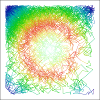
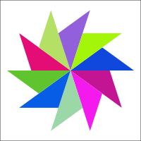

### PythonGen_SVGImage

Python generator for SVG.    

#### SVG coordinate system  

#### SVG images by using python  
|||
|---|---|
|||
|||
|||
|||
|||
|||
|||
||
|||
|||
|||
|||
|||
|||
|||
|||
|||
|||
|||
|||

Rerferences  
WiKi: https://en.wikipedia.org/wiki/Scalable_Vector_Graphics  
SVG: https://www.w3.org/Graphics/SVG/
 
 

Practical data visualization resources：  
https://en.wikipedia.org/wiki/Data_visualization  
https://www.visualcinnamon.com/  
https://www.hongkiat.com/blog/svg-animations/  
https://informationisbeautiful.net/  
https://datavizproject.com/  